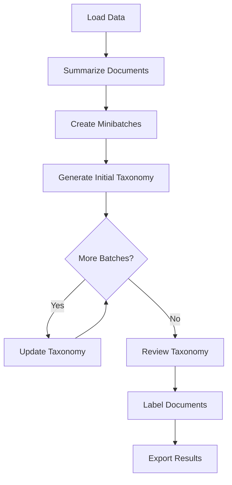

## Background: The TNT-LLM Approach

Delve is heavily inspired by the [TNT-LLM paper](https://arxiv.org/abs/2403.12173) (Taxonomy and Text LLM), which introduces a novel approach to automated taxonomy generation and document classification. The key insight is combining **unsupervised taxonomy discovery** with **supervised classification** for efficient, high-quality results at scale.

### The Challenge

Traditional approaches to document categorization face significant tradeoffs:

| Approach | Pros | Cons |
|----------|------|------|
| **Manual taxonomy creation** | High quality, domain-specific | Time-consuming, requires expertise, doesn't scale |
| **Pure unsupervised clustering** | Fast, automatic | Poor interpretability, inconsistent categories |
| **Pure LLM labeling** | High accuracy, good explanations | Expensive at scale, slow throughput |
| **Traditional ML classifiers** | Fast, cheap at scale | Requires labeled training data, cold-start problem |

### The Hybrid Solution

Delve solves this by combining the best of both worlds:

1. **LLM-Powered Taxonomy Discovery** (Unsupervised Phase)
   - Uses Claude to analyze document samples and discover natural categories
   - Iterative refinement ensures comprehensive, non-overlapping categories
   - No pre-existing taxonomy or labeled data required

2. **Efficient Classifier-Based Labeling** (Supervised Phase)
   - LLM labels a representative sample with high accuracy
   - Train a fast RandomForest classifier on embeddings
   - Classifier labels remaining documents at scale

<Info>
This hybrid approach gives you the quality of LLM reasoning with the efficiency of traditional ML, making it practical to categorize millions of documents cost-effectively.
</Info>

## Why This Approach Works

### Advantages Over Pure LLM Labeling

- **Cost Efficiency**: Instead of paying for LLM calls on every document, you only pay for a sample (e.g., 100-500 documents). The classifier handles the rest.
- **Speed**: Classifier inference is orders of magnitude faster than LLM calls. Label 100,000 documents in seconds instead of hours.
- **Consistency**: Classifiers are deterministic. The same document always gets the same label.

### Advantages Over Pure ML Classification

- **No Cold Start**: You don't need pre-existing labeled data. The LLM creates the training set automatically.
- **Dynamic Taxonomy**: The taxonomy is discovered from your data, not imposed from outside.
- **Quality Training Data**: LLM-labeled samples are high quality with explanations, creating a strong training signal.

### Advantages Over Pure Clustering

- **Interpretability**: Categories have meaningful names and descriptions, not just "Cluster 0, 1, 2..."
- **Consistency**: Category definitions are explicit and stable.
- **Validation**: Built-in quality review ensures taxonomy makes sense before labeling.

## The Pipeline Phases

Delve uses a sophisticated 8-stage pipeline powered by [LangGraph](https://langchain-ai.github.io/langgraph/):

### Phase 1: Data Loading

**What happens:** Documents are loaded from your data source (CSV, JSON, DataFrame, or LangSmith) and sampled if `sample_size < total documents`.

**Why it matters:** Sampling ensures efficient processing while maintaining representative coverage. If you have 100,000 documents but set `sample_size=200`, only 200 documents go through the expensive LLM taxonomy generation phase.

<Tip>
If you provide a `predefined_taxonomy`, this phase loads it and the pipeline skips directly to the labeling phase.
</Tip>

### Phase 2: Document Summarization

**What happens:** The fast LLM (Claude Haiku by default) generates concise summaries of each sampled document.

**Why it matters:**
- **Token efficiency**: Summaries use fewer tokens in subsequent phases
- **Noise reduction**: Summaries capture the essential meaning, removing irrelevant details
- **Better clustering**: Summaries are more uniform in length and style, improving category quality

**Output:** Each document gets a `summary` and `explanation` field.

### Phase 3: Minibatch Generation

**What happens:** Sampled documents are divided into minibatches of `batch_size` documents each.

**Why it matters:** Processing documents in batches allows:
- Iterative taxonomy refinement (each batch can introduce new categories or merge existing ones)
- Better memory management for large samples
- More opportunities for the LLM to see diverse examples

### Phase 4: Initial Taxonomy Generation

**What happens:** The main LLM (Claude Sonnet by default) analyzes the first minibatch and generates an initial taxonomy with up to `max_num_clusters` categories.

**Key constraints enforced:**
- Categories must be orthogonal (non-overlapping)
- No vague categories like "Other", "General", or "Miscellaneous"
- Each category needs a clear name and description

**Output:** Initial taxonomy with category IDs, names, and descriptions.

### Phase 5: Iterative Taxonomy Updates

**What happens:** For each remaining minibatch, the LLM reviews the current taxonomy against new documents and refines it:
- Add new categories if documents don't fit existing ones
- Merge similar categories to reduce redundancy
- Refine category descriptions for clarity

**Why it matters:** This iterative approach ensures the taxonomy captures the full diversity of your data, not just what appeared in the first batch.

### Phase 6: Quality Review

**What happens:** The LLM performs a final review of the taxonomy:
- Checks for coverage (can all documents be categorized?)
- Validates category distinctness
- Ensures descriptions are clear and actionable

**Conditional routing:** If quality issues are found, the pipeline may loop back for additional refinement.

### Phase 7: Document Labeling

This is where the **hybrid approach** shines:

**Step 1: LLM Labeling (Training Set)**
- All sampled documents are labeled by the fast LLM
- Each document gets a category assignment with an explanation
- These labeled documents become training data

**Step 2: Classifier Training (if needed)**
- If `sample_size < total documents`, embeddings are generated for all documents
- A RandomForest classifier is trained on the LLM-labeled samples
- The classifier learns to map embeddings to categories

**Step 3: Classifier Inference**
- Remaining documents are classified using the trained model
- Much faster than LLM calls (thousands per second vs. a few per second)
- Optional confidence threshold for LLM fallback on uncertain predictions

<Info>
The `classifier_confidence_threshold` parameter controls when to fall back to LLM labeling. Set to 0.0 (default) to use the classifier for all documents, or set higher (e.g., 0.8) to use LLM for low-confidence predictions.
</Info>

### Phase 8: Results Export

**What happens:** Results are saved in your requested formats:
- `taxonomy.json` - Machine-readable taxonomy
- `labeled_documents.json` - All documents with categories
- `labeled_data.csv` - Spreadsheet format
- `report.md` - Human-readable summary
- `metadata.json` - Run statistics and classifier metrics

## Understanding the Tradeoffs

### Sample Size vs. Taxonomy Quality

| Sample Size | Quality | Cost | Speed |
|-------------|---------|------|-------|
| 50-100 | Good for homogeneous data | $ | Fast |
| 100-200 | Balanced, recommended starting point | $$ | Moderate |
| 200-500 | Comprehensive, diverse datasets | $$$ | Slower |
| 500+ | Diminishing returns | $$$$ | Slow |

### When to Use Each Approach

**Use small samples (50-100)** when:
- Your data is fairly homogeneous
- You're iterating quickly on taxonomy design
- Budget is constrained

**Use larger samples (200-500)** when:
- Your data is highly diverse
- You need comprehensive category coverage
- Accuracy is critical

**Set `sample_size=0`** when:
- You have very few documents (< 200)
- You want every document labeled by the LLM
- You don't need classifier-based scaling

## Next Steps

<CardGroup cols={2}>
  <Card title="Configuration Guide" icon="sliders" href="/configuration-guide">
    Learn how to tune parameters for your use case
  </Card>
  <Card title="SDK Reference" icon="code" href="/sdk-reference">
    Complete API documentation
  </Card>
</CardGroup>
